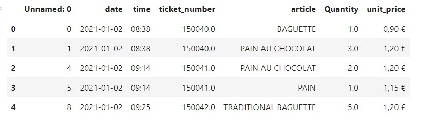

# Laporan Proyek Machine Learning
### Nama : Lia Nurmalasari
### Nim : 211351073
### Kelas : Malam B

## Domain Proyek

Aplikasi ini adalah platform yang didedikasikan untuk membawa pengalaman unik kepada pelanggan di toko roti Prancis. Proyek ini menggunakan teknologi machine learning untuk meningkatkan penjualan melalui strategi cross-selling yang cerdas.

## Business Understanding

Aplikasi yang bertujuan untuk memberikan solusi yang inovatif bagi pemilik toko roti Prancis dengan menggunakan teknologi machine learning untuk meningkatkan penjualan melalui strategi cross-selling. Platform ini menyajikan rekomendasi produk yang cerdas dan penawaran promosi khusus untuk mendorong pembelian produk bersama yang sesuai dengan preferensi pelanggan.

Bagian laporan ini mencakup:

### Problem Statements

- Tidak ada sistem yang mendukung pemilik toko roti Prancis dalam merencanakan dan melaksanakan strategi cross-selling dengan cerdas.
- Sulitnya dalam mengenali pola pembelian dan preferensi pelanggan secara akurat, menghambat personalisasi strategi penjualan.
- Tidak adanya penawaran promosi yang spesifik dan menarik untuk produk bersama yang dapat mendorong pembelian tambahan.

### Goals

- Menyediakan platform yang memungkinkan pemilik toko roti merencanakan, mengimplementasikan, dan memantau strategi cross-selling dengan efisien.
- Mengembangkan kemampuan untuk mengidentifikasi pola pembelian dan preferensi pelanggan melalui analisis data transaksi.
- Menyediakan analisis yang mudah dimengerti untuk membantu pemilik toko roti membuat keputusan strategis berdasarkan data pelanggan dan penjualan.

## Data Understanding

Dataset ini milik sebuah toko roti Prancis. Dataset ini memberikan detail transaksi harian pelanggan dari tanggal 1 Januari 2021 hingga 30 September 2022. Terdapat musiman tahunan dan mingguan yang dapat diamati.<br> 

[French bakery daily sales](https://www.kaggle.com/datasets/matthieugimbert/french-bakery-daily-sales).

Selanjutnya uraikanlah seluruh variabel atau fitur pada data. Sebagai contoh:  

### Variabel-variabel yang di pakai pada Mobile Price Prediction adalah sebagai berikut:

- date : date order.<br> 
  type data : object  <br> 

- time: time order.<br> 
  type data : object  <br> 

- ticket number: identifier for every single transaction.<br> 
  type data : float64 <br> 

- article: name of the product sold (in French).<br> 
  type data : object  <br> 

- quantity: quantity sold.<br> 
  type data : float64 <br> 

- unit_price: price per product.<br> 
  type data : object  <br> 

## Data Preparation

Pengambilan data disini saya mendapatkan datasetnya dari dari website kaggle bernama French bakery daily sales dataset, untuk link datasets sudah saya attach di bagian #data understanding.Dan semua kodingan ini berlaku untuk yg menggunakan google collab karena ada pemanggilan dataset otomatis secara online.

adapun library yg saya gunakan kali ini yaitu :
  ```
  import pandas as pd
  import numpy as np
  import matplotlib.pyplot as plt
  import seaborn as sns
  import networkx as nx
  import warnings
  warnings.filterwarnings('ignore')
  ```
  dan untuk library model apriorinya :
  ```
  from mlxtend.frequent_patterns import association_rules, apriori
  ```
  
  Selanjutnya untuk import API Kaggle saya menggunkan Teknik berikut :
  
  ```
  from google.colab import files
  files.upload()  
  ```

  Lalu, untuk menyimpan file kaggle.json melalui google collab:

  ```
  !mkdir -p ~/.kaggle
  !cp kaggle.json ~/.kaggle/
  !chmod 600 ~/.kaggle/kaggle.json
  !ls ~/.kaggle
  ```

  Berikutnya, kita mendownload dataset dari keggle nya :

  ```
  !kaggle datasets download -d heeraldedhia/groceries-dataset
  ```

  setelah itu kita perlu mengekstrak dataset yg sudah didownload tadi:

  ```
  !mkdir groceries-dataset
  !unzip groceries-dataset
  !ls groceries-dataset
  ```
  setelah di ekstrak kita perlu memanggil datasetnya dengan menggunakan :

  ```
  df = pd.read_csv('/content/french-bakery-daily-sales/Bakery sales.csv')
  ```

  ### Data Discovery and Visualization 

  Untuk bagian Data discovery saya menggunakan teknik EDA

  Setelah melakukan data collecting, maka kita perlu mendeskripsikan variabel :
  ```
  df.head()
  ```
  <br> 
  
  lanjut visualisasi data yg pertama kita cek data top selling product :
  ```
  top_10_item = df['article'].value_counts().nlargest(10)

  plt.figure(figsize=(8, 8))
  plt.pie(top_10_item, labels=top_10_item.index, autopct='%1.1f%%', startangle=90)
  plt.title('Top 10 Produk Terlaris')
  plt.show()
  ```
  <br> 
  selanjutnya masih memvisualisasikan data yg pertama kita cek data top selling product namun berbentuk barplot:
  ```
  freq = (df['article'].value_counts())
  freq.head()
  ```
  dan kita buat jadi barplot:
  ```
  plt.figure(figsize = (15,5))
  bars = plt.bar(x = np.arange(len(freq.head(10))), height = (freq).head(10))
  plt.bar_label(bars, fontsize=12, color='blue', label_type = 'center')
  plt.xticks(ticks = np.arange(len(freq.head(10))), labels = freq.index[:10])

  plt.title('Top 10 Products')
  plt.ylabel('Count')
  plt.xlabel('Product Name')
  plt.show()
  ```
  <br> 
  selanjutnya kita cek untuk low sellingnya atau produk yg jarang di beli :
  ```
  low_10_item = df['article'].value_counts().nsmallest(10)

  plt.figure(figsize=(12, 6))
  sns.countplot(x=df['article'], data=df, order=low_10_item.index, palette='viridis')
  plt.xlabel('Nama Item')
  plt.ylabel('Count')
  plt.title('10 item paling jarang dibeli')
  plt.xticks(rotation=45, ha='right')
  plt.tight_layout()

  plt.show()
  ```
  <br> 

### Data Preprosessing

  Pertama tama kita perlu untuk merubah kolom ticket_number menjadi int terlebih dahulu :
  ```
  df['ticket_number'] = df['ticket_number'].astype(int)
  ```
  
  lalu kita satukan kolom date dan kolom time untuk menjadi datatimenya dan drop kolom date serta kolom timenya : 
  ```
  df['Datetime'] = pd.to_datetime(df['date'] + ' ' + df['time'], format='%Y-%m-%d %H:%M')
  ```
  ```
  df = df.drop(['date','time'],axis=1)
  ```
  setelah itu kita udah kolom datetime tadi menjadi 3 kolom yaitu date,month,dan weekday:
  ```
  df['date'] = df['Datetime'].dt.date

  df['month'] = df['Datetime'].dt.month
  df['month'] = df['month'].replace((1,2,3,4,5,6,7,8,9,10,11,12),
                                            ('January','February','March','April','May','June','July','August',
                                            'September','October','November','December'))

  df['weekday'] = df['Datetime'].dt.weekday
  df['weekday'] = df['weekday'].replace((0,1,2,3,4,5,6),
                                            ('Senin','Selasa','Rabu','Kamis','Jumat','Sabtu','Minggu'))

  df.drop('Datetime', axis = 1, inplace = True)
  ```
  dan terakhir kita tampilkan data penjualan berdasarkan hari dan bulannya :
  ```
  plt.figure(figsize=(8,5))
  sns.countplot(x='weekday',data=df)
  plt.title('Penjualan Produk Berdasarkan hari')
  plt.show()
  ```
  <br> 
  ```
  plt.figure(figsize=(12,5))
  sns.countplot(x='month',data=df)
  plt.title('Penjualan Produk Berdasarkan Bulan')
  plt.show()
  ```
  <br> 

## Modeling

pertama tama mari kita hitung data dan grup berdasarkan ticket_number dan article :
```
item_count = df.groupby(["ticket_number", "article"])["article"].count().reset_index(name="Count")
item_count.head(10)
```
lalu kita pisahkan dan hitung ticket_number dan setiap ticket_number melakukan pembeliin ditanggal brp saja dan buat jadi berbentuk int:
```
item_count_pivot = item_count.pivot_table(index='ticket_number', columns='article', values='Count', aggfunc='sum').fillna(0)
print("Ukuran Dataset : ", item_count_pivot.shape)
item_count_pivot.head(5)
```
```
item_count_pivot = item_count_pivot.astype("int32")
item_count_pivot.head()
```
lalu kita encode lagi datanya
```
def encode(x):
    if x <=0:
        return 0
    elif x >= 1:
        return 1

item_count_pivot = item_count_pivot.applymap(encode)
item_count_pivot.head()
```
lalu kita setting minimum support dan coba tampilkan data nya:
```
support = 0.02
frequent_items = apriori(item_count_pivot, min_support=support, use_colnames=True)
frequent_items.sort_values("support", ascending=False).head(10)
```
setelah itu kita mulai masuk ke metricnya dan setting minimum tresholdnya disini saya menggunakan minimum treshold 1:
```
metric = "lift"
min_treshold = 1

rules = association_rules(frequent_items, metric=metric, min_threshold=min_treshold)[["antecedents","consequents","support","confidence","lift"]]
rules.sort_values('confidence', ascending=False,inplace=True)
rules.head(15) 
```
## Visualisasi hasil algoritma

saya menggunakan metode apriori jadi untuk visulalisasinya saya menggunakan graf untuk metode penggambarannya :
```
G = nx.Graph()

for index, row in rules.iterrows():
    G.add_edge(', '.join(row['antecedents']), ', '.join(row['consequents']), weight=row['lift'])

pos = nx.spring_layout(G)

nx.draw(G, pos, with_labels=True, font_size=7, node_size=1000, node_color='skyblue', font_color='black', font_weight='bold', edge_color='gray', width=[d['weight'] * 0.1 for u, v, d in G.edges(data=True)])
plt.title('Association Rules Network Visualization')
plt.show()
     
```


## Deployment

Model yang sudah di buat di deploy menggunakan streamlit: 
Link Aplikasi: [Market Basket Analysis With Apriori](https://french-bakery-lia.streamlit.app/).
